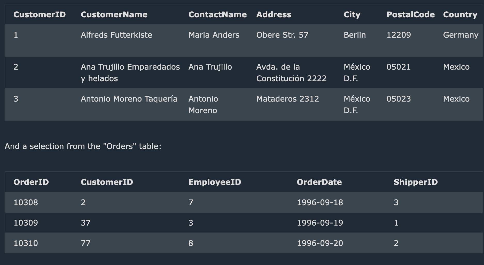

# JOINS


From the image, you provided two tables:

1. **Customers** table with fields:
   - CustomerID, CustomerName, ContactName, Address, City, PostalCode, Country.

2. **Orders** table with fields:
   - OrderID, CustomerID, EmployeeID, OrderDate, ShipperID.

### Let's break down the joins based on these tables:

#### 1. **INNER JOIN**:
   The **INNER JOIN** will return records that have matching values in both the `Customers` and `Orders` tables.

   **Query**:
   ```sql
   SELECT Customers.CustomerID, Customers.CustomerName, Orders.OrderID, Orders.OrderDate
   FROM Customers
   INNER JOIN Orders
   ON Customers.CustomerID = Orders.CustomerID;
   ```

   **Output** (based on the given data):
   The `INNER JOIN` will only return records where the `CustomerID` exists in both tables.

   | CustomerID | CustomerName                 | OrderID | OrderDate  |
   |------------|------------------------------|---------|------------|
   | 2          | Ana Trujillo Emparedados y helados | 10308   | 1996-09-18 |

   - Only CustomerID 2 from the `Customers` table matches with the `Orders` table.
   - CustomerIDs 37 and 77 in the `Orders` table are not present in the `Customers` table, so they are excluded from the result.

#### 2. **LEFT JOIN**:
   The **LEFT JOIN** returns all records from the `Customers` table and the matching records from the `Orders` table. If there's no match, NULL values will be returned for the `Orders` columns.

   **Query**:
   ```sql
   SELECT Customers.CustomerID, Customers.CustomerName, Orders.OrderID, Orders.OrderDate
   FROM Customers
   LEFT JOIN Orders
   ON Customers.CustomerID = Orders.CustomerID;
   ```

   **Output**:

   | CustomerID | CustomerName                   | OrderID | OrderDate  |
   |------------|---------------------------------|---------|------------|
   | 1          | Alfreds Futterkiste             | NULL    | NULL       |
   | 2          | Ana Trujillo Emparedados y helados | 10308   | 1996-09-18 |
   | 3          | Antonio Moreno Taquería         | NULL    | NULL       |

   - All customers are included.
   - For customers with no matching order, the `OrderID` and `OrderDate` fields are `NULL` (CustomerID 1 and 3).

#### 3. **RIGHT JOIN**:
   The **RIGHT JOIN** returns all records from the `Orders` table and the matching records from the `Customers` table. If there is no match, NULL values will be returned for the `Customers` columns.

   **Query**:
   ```sql
   SELECT Customers.CustomerID, Customers.CustomerName, Orders.OrderID, Orders.OrderDate
   FROM Customers
   RIGHT JOIN Orders
   ON Customers.CustomerID = Orders.CustomerID;
   ```

   **Output**:

   | CustomerID | CustomerName                   | OrderID | OrderDate  |
   |------------|---------------------------------|---------|------------|
   | 2          | Ana Trujillo Emparedados y helados | 10308   | 1996-09-18 |
   | NULL       | NULL                            | 10309   | 1996-09-19 |
   | NULL       | NULL                            | 10310   | 1996-09-20 |

   - All orders are included.
   - For orders with no matching customer, the `CustomerID` and `CustomerName` fields are `NULL` (OrderID 10309 and 10310).

#### 4. **FULL OUTER JOIN**:
   The **FULL OUTER JOIN** returns all records when there is a match in either the `Customers` or `Orders` table. If there is no match, NULL values will be returned for the missing side.

   **Query**:
   ```sql
   SELECT Customers.CustomerID, Customers.CustomerName, Orders.OrderID, Orders.OrderDate
   FROM Customers
   FULL OUTER JOIN Orders
   ON Customers.CustomerID = Orders.CustomerID;
   ```

   **Output**:

   | CustomerID | CustomerName                   | OrderID | OrderDate  |
   |------------|---------------------------------|---------|------------|
   | 1          | Alfreds Futterkiste             | NULL    | NULL       |
   | 2          | Ana Trujillo Emparedados y helados | 10308   | 1996-09-18 |
   | 3          | Antonio Moreno Taquería         | NULL    | NULL       |
   | NULL       | NULL                            | 10309   | 1996-09-19 |
   | NULL       | NULL                            | 10310   | 1996-09-20 |

   - All records from both tables are included.
   - For missing matches, the corresponding columns have `NULL` values.

### Summary of the Differences:
- **INNER JOIN**: Only returns records where there is a match between `Customers` and `Orders`.
- **LEFT JOIN**: Returns all records from `Customers`, with `NULL` for unmatched rows in `Orders`.
- **RIGHT JOIN**: Returns all records from `Orders`, with `NULL` for unmatched rows in `Customers`.
- **FULL OUTER JOIN**: Returns all records from both tables, with `NULL` where there are no matches.