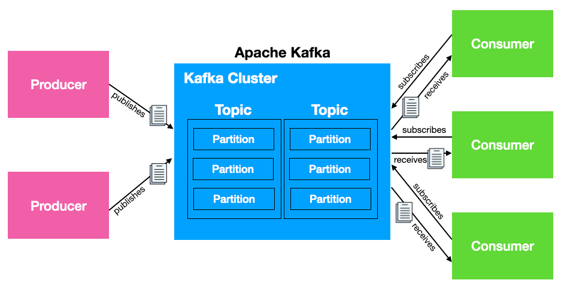

Apache Kafka’s architecture is designed for high-throughput, distributed, and fault-tolerant real-time data streaming. It allows for data to be produced and consumed in a distributed, scalable, and resilient way. Let’s explore its core concepts and architecture in detail:

## **Core Concepts in Kafka:**

1. **Topic:**
    - A **topic** in Kafka is a category or feed name to which records (messages) are published.
    - Producers send data to topics, and consumers subscribe to them to receive data.
    - Topics are partitioned, allowing Kafka to scale horizontally. Each topic can have one or more **partitions**.
2. **Producer:**
    - Producers are applications or services that write data to Kafka. Producers send messages to Kafka topics, which are partitioned.
    - Producers can specify the partition to which the message should be written, or Kafka can decide it automatically (e.g., based on the message key).
3. **Consumer:**
    - Consumers read messages from Kafka topics. They can subscribe to one or more topics and read the messages in the order they were produced (within each partition).
    - Kafka allows consumers to track their **offset** in the partition, which represents the position of the last message they processed.
    - **Consumer Groups**: Consumers can form a consumer group, and Kafka will distribute the partitions of a topic among the consumers in the group, allowing parallel consumption.
4. **Partition:**
    - A **partition** is a horizontal scaling unit within a topic. Each partition is an ordered, immutable sequence of messages that Kafka appends to.
    - Partitions enable Kafka to split the load across multiple servers, allowing scalability.
    - Kafka guarantees that the messages within a partition are **strictly ordered**, but there is no guarantee of order across partitions.
5. **Offset:**
    - Each message in a partition has an **offset**, a unique identifier that indicates its position in the partition. Consumers use offsets to keep track of which messages they have consumed.
6. **Broker:**
    - A **broker** is a Kafka server that stores and serves the messages (data) from producers to consumers.
    - Kafka brokers form a **Kafka cluster**. Each broker in the cluster is responsible for serving a subset of topic partitions.
    - Brokers replicate data among themselves to provide fault tolerance.
7. **Zookeeper:**
    - **Zookeeper** is a distributed coordination service used by Kafka to manage metadata, broker leadership, topic configurations, and partition leader election.
    - Kafka uses Zookeeper for maintaining cluster state and leader election for partitions.
8. **Replication:**
    - Kafka provides fault tolerance by **replicating** partitions across multiple brokers.
    - Each partition has a **leader** and multiple **replicas**. The leader handles all read and write requests for the partition, and the replicas are backups in case the leader fails.
    - If the leader fails, one of the replicas takes over as the new leader to ensure availability.
9. **Log:**
    - Kafka stores data in a **log**. Each partition is an ordered log where new messages are appended to the end.
    - Messages in the log are stored for a configurable amount of time (set by the retention policy) or until the log reaches a size limit.
10. **Producer Acknowledgment Modes:**
    - Kafka producers can choose the level of **acknowledgment** they require after sending a message:
        - **acks=0**: The producer doesn’t wait for any acknowledgment from the broker.
        - **acks=1**: The producer gets an acknowledgment from the leader broker once the message is written to the leader’s log.
        - **acks=all**: The producer gets acknowledgment only after all in-sync replicas confirm that the message is written to their logs, ensuring stronger durability guarantees.

---

## **Kafka Architecture Components:**

### **1. Topics and Partitions:**

- Kafka topics are divided into **partitions** for scalability. A topic can be spread across multiple partitions (potentially on different brokers).
- The number of partitions defines the parallelism, as each partition can be consumed independently.
- Each partition is replicated to ensure fault tolerance, with a configurable **replication factor**.

### **2. Kafka Cluster:**

A Kafka cluster consists of multiple **brokers**. These brokers are responsible for storing partitioned logs, receiving and serving requests from producers and consumers, and replicating data.

- Each partition has a **leader broker** and **follower brokers** (replicas). Producers and consumers interact only with the leader of the partition.
- Kafka brokers are distributed across different servers, providing redundancy and load balancing.

### **3. Producers and Consumers:**

- **Producers**: Applications that send data to Kafka topics. They determine the partition to which the message should be sent based on the message’s **key** or using Kafka’s default partitioning strategy (round-robin if no key is provided).
- **Consumers**: Applications that read data from Kafka topics. They subscribe to topics and read from specific partitions, either independently or as part of a **consumer group**.
    - In a **consumer group**, Kafka ensures that each partition is read by only one consumer within the group, allowing for parallel consumption across partitions.

### **4. Kafka Broker:**

- Each **Kafka broker** handles a subset of partitions for topics.
- The broker is responsible for storing data and managing log segments on disk.
- Kafka brokers communicate with **ZooKeeper** to maintain metadata about the cluster and handle leader elections for partitions.

### **5. Zookeeper (Coordination Service):**

- **Zookeeper** plays a crucial role in maintaining the **Kafka cluster's health**. It handles the following tasks:
    - Managing metadata about which brokers are part of the cluster.
    - Assigning and electing **partition leaders** among brokers.
    - Tracking **consumer group offsets** (although Kafka is gradually moving this responsibility to its internal storage mechanism).

### **6. Replication and Fault Tolerance:**

Kafka uses **replication** to achieve fault tolerance. Each partition is replicated across multiple brokers to ensure data availability in case a broker fails.

- Kafka partitions are assigned a **leader broker**, and the rest are **followers** (replicas).
- When the leader fails, one of the replicas becomes the new leader, ensuring **high availability**.

### **7. Kafka’s Log-Based Storage:**

Kafka stores data in **logs** for each partition. Each log contains an ordered sequence of **messages** (records). These logs are append-only and immutable.

- Kafka maintains messages in logs for a configurable time period (set via **retention policies**). This allows Kafka to retain messages for **replayability**.
- Logs are split into segments for efficient data management. Once the retention limit is reached, older segments are purged.

---

## **Key Features of Kafka Architecture:**

1. **Scalability**:
    - Kafka is highly scalable both horizontally (across multiple brokers) and vertically (through partitioning).
    - Multiple brokers can store different partitions of the same topic, distributing the load.
2. **Fault Tolerance**:
    - Kafka’s **replication** mechanism ensures that even if a broker fails, data is not lost. Kafka automatically elects new leaders from replicas.
3. **Message Retention**:
    - Unlike traditional message brokers, Kafka retains messages for a configurable period, allowing consumers to **replay** messages.
    - This feature makes Kafka ideal for scenarios like **event sourcing** or reprocessing data streams.
4. **Distributed and Durable**:
    - Kafka distributes data across brokers and partitions, ensuring **high availability** and **data durability**.
5. **High Throughput and Low Latency**:
    - Kafka’s design is optimized for high-throughput scenarios and can process millions of messages per second with low latency.
6. **Exactly Once Semantics (EOS)**:
    - Kafka supports **exactly-once processing** semantics for producers and consumers, ensuring that data is neither lost nor duplicated under specific configurations.

---

### **Kafka Ecosystem:**

- **Kafka Connect**: Used for integrating Kafka with external data systems such as databases and file systems. It helps in building **data pipelines**.
- **Kafka Streams**: A stream-processing library for Kafka. It allows developers to process and analyze real-time streams of data using Kafka’s event-driven architecture.
- **ksqlDB**: A SQL-based engine for real-time data streaming and processing on top of Kafka.

---

### Consumer Group Logic in Kafka

**Consumer Groups:**
- A consumer group is a group of consumers that work together to consume messages from one or more topics.
- Each consumer in a group reads messages from exclusive partitions, ensuring that each message is processed only once by a consumer in that group.
- This mechanism allows for parallel processing of messages and improves throughput.

**Key Concepts:**

1. **Partition Assignment:**
   - When a consumer group subscribes to a topic, Kafka assigns partitions of that topic to the consumers within the group.
   - The assignment can be done through several strategies, such as:
     - **Range:** Assigns a contiguous range of partitions to each consumer.
     - **Round Robin:** Distributes partitions evenly across consumers.
     - **Sticky:** A new assignment is created by first trying to keep the previous assignments of consumers.

2. **Load Balancing:**
   - If a new consumer joins the group, Kafka rebalances the partitions among all the consumers. This ensures that the workload is evenly distributed.
   - Similarly, if a consumer fails or leaves the group, Kafka triggers a rebalance to redistribute the partitions to the remaining consumers.

3. **Offset Management:**
   - Kafka maintains offsets for each partition within a consumer group. This offset indicates the position of the last message processed by the consumer.
   - Each consumer can commit offsets to Kafka after processing messages, allowing them to track their progress.
   - If a consumer fails, it can resume processing from the last committed offset, ensuring that no messages are lost or reprocessed unnecessarily.

4. **Consumer Group Coordination:**
   - Kafka uses Zookeeper to manage consumer group membership and partition assignment.
   - Each consumer in a group sends heartbeat signals to Zookeeper to indicate that it is alive. If a consumer fails to send a heartbeat, Zookeeper marks it as dead and triggers a rebalance.

5. **Scaling Consumers:**
   - You can scale consumer groups by adding more consumer instances to handle increased message loads. However, the number of consumers should not exceed the number of partitions in the topic; otherwise, some consumers will remain idle.

### Example Scenario
Consider a Kafka topic named `orders` with 6 partitions and a consumer group named `order_processing_group` with 3 consumers:

- **Partition Assignment:**
  - Each consumer would be assigned 2 partitions.
  - For instance, Consumer 1 might read from Partition 0 and Partition 1, Consumer 2 from Partition 2 and Partition 3, and Consumer 3 from Partition 4 and Partition 5.

- **Load Balancing:**
  - If a fourth consumer is added to the group, Kafka will redistribute the partitions:
    - Now, each consumer might handle only 1 partition, improving the parallel processing of messages.

- **Offset Management:**
  - Each consumer tracks its offsets independently. For instance, if Consumer 1 processed messages from Partition 0 and its last processed message had an offset of 15, it will commit that offset. If it crashes, upon restarting, it will begin reading from offset 16.

### Benefits of Consumer Group Logic
- **Scalability:** Multiple consumers can process messages in parallel, increasing throughput.
- **Fault Tolerance:** If one consumer fails, others can continue processing, and Kafka will rebalance the workload.
- **Efficient Resource Utilization:** Ensures that consumers are utilized effectively by managing partition assignments dynamically.
