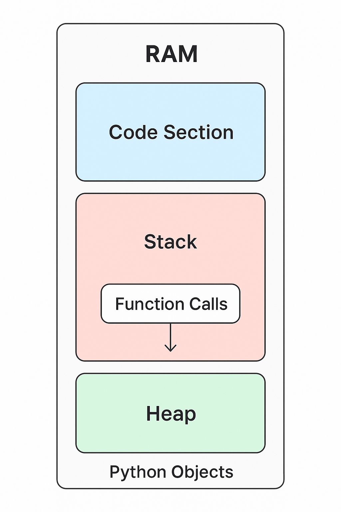

### 🖥️ Step 1: Where your program lives

- When you **write a Python program** (say `hello.py`) and save it, it sits quietly on your **Hard Disk (HDD/SSD)**.
  Think of the hard disk as a **library shelf** — books (programs) are stored there, but you can’t read them directly without picking them up.

- When you **run your program**, the operating system (like Windows/Linux/Mac) **picks up the book** from the shelf (HDD) and **places it on the study table** (RAM).

  👉 **Analogy:** HDD = bookshelf (long-term storage), RAM = study desk (fast, active workspace).

---

### 🧾 Step 2: Program becomes a Process

- Once the program is in **RAM**, it becomes a **process** (a program that is actively running).
- The **CPU (brain of the computer)** reads from RAM line by line and executes the instructions.

👉 Think of RAM as a whiteboard where the CPU keeps writing, erasing, and updating numbers while solving math problems.

---

### 🧩 Step 3: How memory in RAM is divided

When your program is loaded into RAM, the memory is usually divided into **sections**:

1. **Code Section (Text Segment)**

   - This is where the actual **compiled instructions** of your program live.
   - The CPU keeps reading from here.
   - In your analogy, this is like the **recipe** the chef is following.

2. **Stack**

   - This is an area for **temporary, quick-to-use data**:

     - Function calls
     - Local variables
     - Return addresses (where to go back after a function finishes)

   - It’s like a **stack of plates**: you put one on top, then another, and you always remove the top one first (**Last-In-First-Out = LIFO**).

   ⚠️ Stack memory is mostly managed at **compile time** (or just when the program is running in an organized way).
   In languages like C/C++, sizes are known at compile time. But in Python, it’s a little more flexible because Python is interpreted, not fully compiled to machine code.

3. **Heap**

   - This is where **dynamic memory** lives.
   - If your program doesn’t know in advance how much memory it needs (like when you create a big list or load a file), it goes to the **heap**.
   - The heap is like a **big toy box** — you can put toys (objects) in and take them out, but it can get messy if you don’t clean up (garbage collection does this in Python).

---

### 🛠️ Step 4: Role of Data Structures

- A **data structure** is just a way to **organize data in memory** so that it’s easier and faster to use.
- In RAM, your variables, lists, arrays, etc., are arranged using **data structures** (like boxes, shelves, linked chains).
- In a **database**, information is arranged in a **relational model** (tables, rows, columns).

👉 Both are about **organization**:

- RAM = temporary organization for fast execution.
- DB = long-term organization for storing and retrieving later.

---

### 🔄 Step 5: Python twist

You mentioned:

> "anything such as variables, etc will be allocated in stack during compile time only."

This is **true for C/C++**, but in **Python**:

- Python is **interpreted** (not fully compiled to machine code).
- Variables in Python are actually **objects** stored in the **heap**, not directly in the stack.
- The **stack** in Python mostly keeps track of function calls (call stack).

👉 Example:

```python
def foo():
    x = 10   # x is a variable
    y = [1, 2, 3]  # y is a list

foo()
```

- The function `foo()` goes on the **call stack**.
- The number `10` and the list `[1, 2, 3]` are actually stored in the **heap**, and the stack just keeps references (like pointers) to them.

---

✅ **Final Picture in Memory**
When your Python program runs, memory looks like this:

- **Code Section**: Your Python bytecode (instructions).
- **Stack**: Keeps track of which function is running and temporary references.
- **Heap**: Stores all Python objects (numbers, strings, lists, dicts, etc.).

