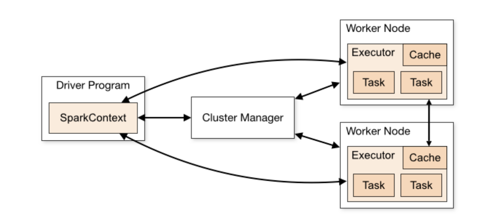

# Architecture

Spark works in a master-slave architecture where the master is called the “Driver” and slaves are called “Workers”. When you run a Spark application, Spark Driver creates a context that is an entry point to your application, and all operations (transformations and actions) are executed on worker nodes, and the resources are managed by Cluster Manager.

