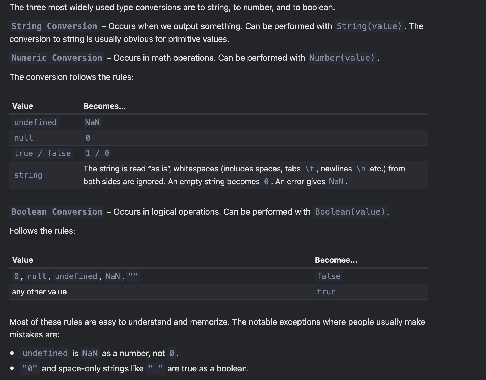

### **Summary of JavaScript Basics**

1. **Origins and Name**

   - JavaScript was created to make web pages interactive and was originally called "LiveScript."
   - It was renamed to "JavaScript" to ride on Java's popularity, though it is entirely independent of Java today.
   - It evolved into a robust language with its own specification, ECMAScript.

2. **Execution and Engines**

   - JavaScript scripts are plain text and run without compilation.
   - Browsers embed JavaScript engines (e.g., V8 for Chrome, SpiderMonkey for Firefox) that parse, compile, and optimize code.

3. **In-Browser Capabilities**

   - Manipulate HTML/CSS dynamically.
   - Respond to user actions and interact with web servers.
   - Handle local storage, cookies, and file uploads/downloads with user permission.

4. **Browser Restrictions for Safety**

   - Limited access to system resources, files, and other tabs.
   - Restricted cross-origin data exchange without explicit agreement (e.g., CORS).
   - Requires user permission for sensitive actions (e.g., using the webcam).

5. **Uses Beyond Browsers**

   - JavaScript is not limited to browsers; it can run on servers (Node.js) and devices with JavaScript engines.

6. **Strengths of JavaScript**

   - Fully integrates with HTML/CSS.
   - Easy to use for simple tasks.
   - Supported by all major browsers, enabled by default.

7. **Languages Transpiled to JavaScript**
   - Modern languages like TypeScript, CoffeeScript, Dart, and Kotlin add features like strict typing or different syntax.
   - These are transpiled to JavaScript for browser compatibility.

JavaScript’s versatility, safety features, and integration with web technologies make it a unique and dominant language for web development.

For a long time, JavaScript evolved without compatibility issues. New features were added to the language while old functionality didn’t change.

That had the benefit of never breaking existing code. But the downside was that any mistake or an imperfect decision made by JavaScript’s creators got stuck in the language forever.

This was the case until 2009 when ECMAScript 5 (ES5) appeared. It added new features to the language and modified some of the existing ones. To keep the old code working, most such modifications are off by default. You need to explicitly enable them with a special directive: "use strict".

```javascript
"use strict";

// this code works the modern way
...
```

## Data types
- let – is a modern variable declaration.
- var – is an old-school variable declaration. Normally we don’t use it at all, but we’ll cover subtle differences from let in the chapter The old "var", just in case you need them.
- const – is like let, but the value of the variable can’t be changed.

> When should we use capitals for a constant and when should we name it normally? Let’s make that clear.

> Being a “constant” just means that a variable’s value never changes. But some constants are known before execution (like a hexadecimal value for red) and some constants are calculated in run-time, during the execution, but do not change after their initial assignment.

1. Addition +,
2. Subtraction -,
3. Multiplication \*,
4. Division /,
5. Remainder %,
6. Exponentiation \*\*.



```javascript
let s = "my" + "string";

// mystring
// Better way:
let s = "mystring";
console.log(`${s}`);
```
Note that if any of the operands is a string, then the other one is converted to a string too.
The binary + is the only operator that supports strings in such a way. Other arithmetic operators work only with numbers and always convert their operands to numbers.
String+ Number = String
```javascript
console.log("1" + 2); // "12" 
console.log(2 + 2 + "1"); // "41" and not "221"
console.log("1" + 2 + 2); // "122" and not "14"

console.log(6 - "2"); // 4, converts '2' to a number
console.log("6" / "2"); // 3, converts both operands to numbers
```
The plus + exists in two forms: the binary form that we used above and the unary form.
The unary plus or, in other words, the plus operator + applied to a single value, doesn’t do anything to numbers. But if the operand is not a number, the unary plus converts it into a number.

The unary plus or, in other words, the plus operator + applied to a single value, doesn’t do anything to numbers. But if the operand is not a number, the unary plus converts it into a number.
It actually does the same thing as Number(...), but is shorter.
```javascript
alert( Boolean(1) ); // true
alert( Boolean(0) ); // false

alert( Boolean("hello") ); // true
alert( Boolean("") ); // false
alert( Boolean("0") ); // true
alert( Boolean(" ") ); // spaces, also true (any non-empty string is true)

let x = 1;

x = -x; 
alert( x ); // -1, unary negation was applied
```
```javascript
alert( 'Z' > 'A' ); // true
alert( 'Glow' > 'Glee' ); // true
alert( 'Bee' > 'Be' ); // true
```
The algorithm to compare two strings is simple:

Compare the first character of both strings.
If the first character from the first string is greater (or less) than the other string’s, then the first string is greater (or less) than the second. We’re done.
Otherwise, if both strings’ first characters are the same, compare the second characters the same way.
Repeat until the end of either string.
If both strings end at the same length, then they are equal. Otherwise, the longer string is greater.
In the first example above, the comparison 'Z' > 'A' gets to a result at the first step.

The second comparison 'Glow' and 'Glee' needs more steps as strings are compared character-by-character:

G is the same as G.
l is the same as l.
o is greater than e. Stop here. The first string is greater.
> The comparison algorithm given above is roughly equivalent to the one used in dictionaries or phone books, but it’s not exactly the same.
> For instance, case matters. A capital letter "A" is not equal to the lowercase "a". Which one is greater? The lowercase "a". Why? Because the lowercase character has a greater index in the internal encoding table JavaScript uses (Unicode).