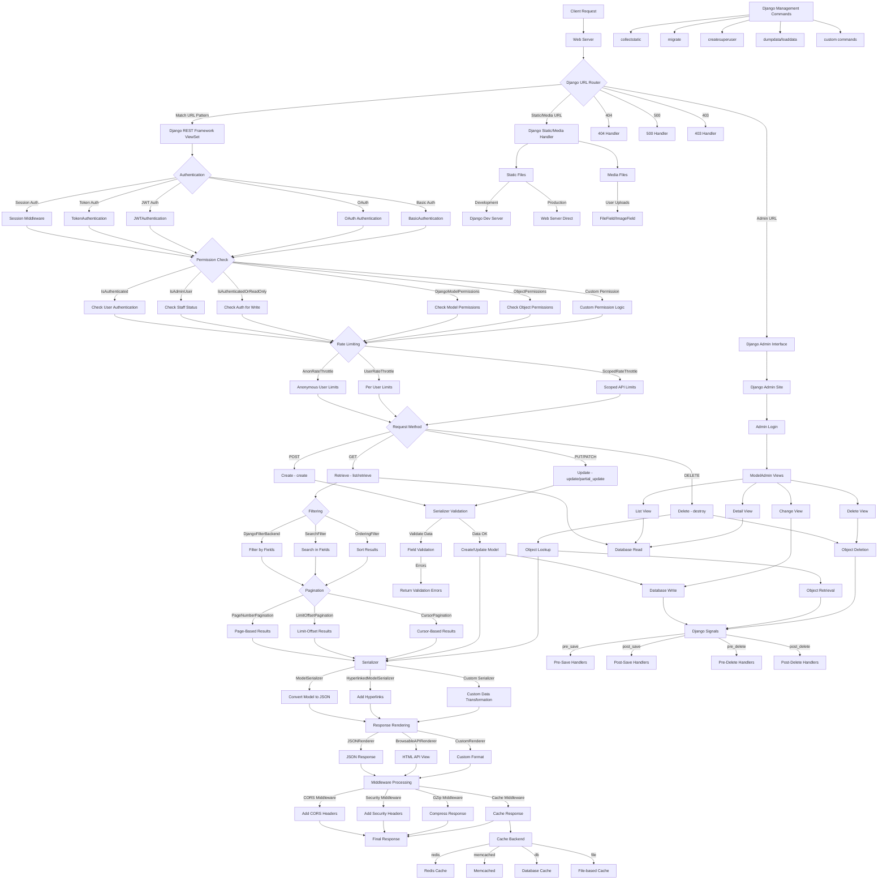

```mermaid
graph TD
    A[Client Request] --> B[Web Server]
    B --> C{Django URL Router}
    
    %% URL Routing
    C -->|Match URL Pattern| D[Django REST Framework ViewSet]
    C -->|Admin URL| AD[Django Admin Interface]
    C -->|Static/Media URL| ST[Django Static/Media Handler]
    
    %% Authentication Flow
    D --> E{Authentication}
    E -->|Session Auth| E1[Session Middleware]
    E -->|Token Auth| E2[TokenAuthentication]
    E -->|JWT Auth| E3[JWTAuthentication]
    E -->|OAuth| E4[OAuth Authentication]
    E -->|Basic Auth| E5[BasicAuthentication]
    E1 --> F{Permission Check}
    E2 --> F
    E3 --> F
    E4 --> F
    E5 --> F
    
    %% Permission Flow
    F -->|IsAuthenticated| F1[Check User Authentication]
    F -->|IsAdminUser| F2[Check Staff Status]
    F -->|IsAuthenticatedOrReadOnly| F3[Check Auth for Write]
    F -->|DjangoModelPermissions| F4[Check Model Permissions]
    F -->|ObjectPermissions| F5[Check Object Permissions]
    F -->|Custom Permission| F6[Custom Permission Logic]
    F1 --> G{Rate Limiting}
    F2 --> G
    F3 --> G
    F4 --> G
    F5 --> G
    F6 --> G
    
    %% Rate Limiting
    G -->|AnonRateThrottle| G1[Anonymous User Limits]
    G -->|UserRateThrottle| G2[Per User Limits]
    G -->|ScopedRateThrottle| G3[Scoped API Limits]
    G1 --> H{Request Method}
    G2 --> H
    G3 --> H
    
    %% HTTP Methods
    H -->|GET| I1[Retrieve - list/retrieve]
    H -->|POST| I2[Create - create]
    H -->|PUT/PATCH| I3[Update - update/partial_update]
    H -->|DELETE| I4[Delete - destroy]
    I1 --> J{Filtering}
    I2 --> K[Serializer Validation]
    I3 --> K
    I4 --> L[Object Lookup]
    
    %% Filtering & Pagination
    J -->|DjangoFilterBackend| J1[Filter by Fields]
    J -->|SearchFilter| J2[Search in Fields]
    J -->|OrderingFilter| J3[Sort Results]
    J1 --> P{Pagination}
    J2 --> P
    J3 --> P
    P -->|PageNumberPagination| P1[Page-Based Results]
    P -->|LimitOffsetPagination| P2[Limit-Offset Results]
    P -->|CursorPagination| P3[Cursor-Based Results]
    P1 --> Q[Serializer]
    P2 --> Q
    P3 --> Q
    
    %% Serialization
    K -->|Validate Data| K1[Field Validation]
    K -->|Data OK| K2[Create/Update Model]
    K1 -->|Errors| K3[Return Validation Errors]
    K2 --> Q
    L --> Q
    Q -->|ModelSerializer| Q1[Convert Model to JSON]
    Q -->|HyperlinkedModelSerializer| Q2[Add Hyperlinks]
    Q -->|Custom Serializer| Q3[Custom Data Transformation]
    
    %% Response & Middleware
    Q1 --> R[Response Rendering]
    Q2 --> R
    Q3 --> R
    R -->|JSONRenderer| R1[JSON Response]
    R -->|BrowsableAPIRenderer| R2[HTML API View]
    R -->|CustomRenderer| R3[Custom Format]
    R1 --> S[Middleware Processing]
    R2 --> S
    R3 --> S
    
    %% Middleware & Response
    S -->|CORS Middleware| S1[Add CORS Headers]
    S -->|Security Middleware| S2[Add Security Headers]
    S -->|GZip Middleware| S3[Compress Response]
    S -->|Cache Middleware| S4[Cache Response]
    S1 --> T[Final Response]
    S2 --> T
    S3 --> T
    S4 --> T
    
    %% Database Operations
    K2 --> DB1[Database Write]
    I1 --> DB2[Database Read]
    L --> DB3[Object Retrieval]
    I4 --> DB4[Object Deletion]
    
    %% Signal System
    DB1 --> SIG[Django Signals]
    DB3 --> SIG
    DB4 --> SIG
    SIG -->|pre_save| SIG1[Pre-Save Handlers]
    SIG -->|post_save| SIG2[Post-Save Handlers]
    SIG -->|pre_delete| SIG3[Pre-Delete Handlers]
    SIG -->|post_delete| SIG4[Post-Delete Handlers]
    
    %% Admin Interface Details
    AD --> AD1[Django Admin Site]
    AD1 --> AD2[Admin Login]
    AD2 --> AD3[ModelAdmin Views]
    AD3 --> AD4[List View]
    AD3 --> AD5[Detail View]
    AD3 --> AD6[Change View]
    AD3 --> AD7[Delete View]
    AD4 --> DB2
    AD5 --> DB2
    AD6 --> DB1
    AD7 --> DB4
    
    %% Caching System
    S4 --> C1[Cache Backend]
    C1 -->|redis| C2[Redis Cache]
    C1 -->|memcached| C3[Memcached]
    C1 -->|db| C4[Database Cache]
    C1 -->|file| C5[File-based Cache]
    
    %% Error Handling
    C -->|404| ERR1[404 Handler]
    C -->|500| ERR2[500 Handler]
    C -->|403| ERR3[403 Handler]
    
    %% Static/Media Handling
    ST --> ST1[Static Files]
    ST --> ST2[Media Files]
    ST1 -->|Development| ST3[Django Dev Server]
    ST1 -->|Production| ST4[Web Server Direct]
    ST2 -->|User Uploads| ST5[FileField/ImageField]
    
    %% Management Commands
    MC[Django Management Commands] --> MC1[collectstatic]
    MC --> MC2[migrate]
    MC --> MC3[createsuperuser]
    MC --> MC4[dumpdata/loaddata]
    MC --> MC5[custom commands]
```
