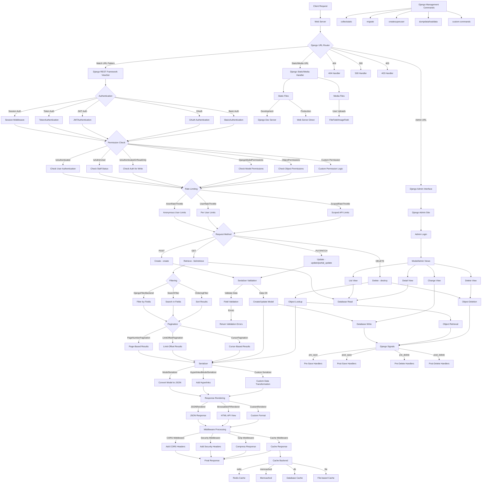

```mermaid
graph TD
    A[Client Request] --> B[Web Server]
    B --> C{Django URL Router}
    
    %% URL Routing
    C -->|Match URL Pattern| D[Django REST Framework ViewSet]
    C -->|Admin URL| AD[Django Admin Interface]
    C -->|Static/Media URL| ST[Django Static/Media Handler]
    
    %% Authentication Flow
    D --> E{Authentication}
    E -->|Session Auth| E1[Session Middleware]
    E -->|Token Auth| E2[TokenAuthentication]
    E -->|JWT Auth| E3[JWTAuthentication]
    E -->|OAuth| E4[OAuth Authentication]
    E -->|Basic Auth| E5[BasicAuthentication]
    E1 --> F{Permission Check}
    E2 --> F
    E3 --> F
    E4 --> F
    E5 --> F
    
    %% Permission Flow
    F -->|IsAuthenticated| F1[Check User Authentication]
    F -->|IsAdminUser| F2[Check Staff Status]
    F -->|IsAuthenticatedOrReadOnly| F3[Check Auth for Write]
    F -->|DjangoModelPermissions| F4[Check Model Permissions]
    F -->|ObjectPermissions| F5[Check Object Permissions]
    F -->|Custom Permission| F6[Custom Permission Logic]
    F1 --> G{Rate Limiting}
    F2 --> G
    F3 --> G
    F4 --> G
    F5 --> G
    F6 --> G
    
    %% Rate Limiting
    G -->|AnonRateThrottle| G1[Anonymous User Limits]
    G -->|UserRateThrottle| G2[Per User Limits]
    G -->|ScopedRateThrottle| G3[Scoped API Limits]
    G1 --> H{Request Method}
    G2 --> H
    G3 --> H
    
    %% HTTP Methods
    H -->|GET| I1[Retrieve - list/retrieve]
    H -->|POST| I2[Create - create]
    H -->|PUT/PATCH| I3[Update - update/partial_update]
    H -->|DELETE| I4[Delete - destroy]
    I1 --> J{Filtering}
    I2 --> K[Serializer Validation]
    I3 --> K
    I4 --> L[Object Lookup]
    
    %% Filtering & Pagination
    J -->|DjangoFilterBackend| J1[Filter by Fields]
    J -->|SearchFilter| J2[Search in Fields]
    J -->|OrderingFilter| J3[Sort Results]
    J1 --> P{Pagination}
    J2 --> P
    J3 --> P
    P -->|PageNumberPagination| P1[Page-Based Results]
    P -->|LimitOffsetPagination| P2[Limit-Offset Results]
    P -->|CursorPagination| P3[Cursor-Based Results]
    P1 --> Q[Serializer]
    P2 --> Q
    P3 --> Q
    
    %% Serialization
    K -->|Validate Data| K1[Field Validation]
    K -->|Data OK| K2[Create/Update Model]
    K1 -->|Errors| K3[Return Validation Errors]
    K2 --> Q
    L --> Q
    Q -->|ModelSerializer| Q1[Convert Model to JSON]
    Q -->|HyperlinkedModelSerializer| Q2[Add Hyperlinks]
    Q -->|Custom Serializer| Q3[Custom Data Transformation]
    
    %% Response & Middleware
    Q1 --> R[Response Rendering]
    Q2 --> R
    Q3 --> R
    R -->|JSONRenderer| R1[JSON Response]
    R -->|BrowsableAPIRenderer| R2[HTML API View]
    R -->|CustomRenderer| R3[Custom Format]
    R1 --> S[Middleware Processing]
    R2 --> S
    R3 --> S
    
    %% Middleware & Response
    S -->|CORS Middleware| S1[Add CORS Headers]
    S -->|Security Middleware| S2[Add Security Headers]
    S -->|GZip Middleware| S3[Compress Response]
    S -->|Cache Middleware| S4[Cache Response]
    S1 --> T[Final Response]
    S2 --> T
    S3 --> T
    S4 --> T
    
    %% Database Operations
    K2 -->|save()| DB1[Database Write]
    I1 -->|query| DB2[Database Read]
    L -->|get()| DB3[Object Retrieval]
    I4 -->|delete()| DB4[Object Deletion]
    
    %% Signal System
    DB1 --> SIG[Django Signals]
    DB3 --> SIG
    DB4 --> SIG
    SIG -->|pre_save| SIG1[Pre-Save Handlers]
    SIG -->|post_save| SIG2[Post-Save Handlers]
    SIG -->|pre_delete| SIG3[Pre-Delete Handlers]
    SIG -->|post_delete| SIG4[Post-Delete Handlers]
    
    %% Admin Interface Details
    AD --> AD1[Django Admin Site]
    AD1 --> AD2[Admin Login]
    AD2 --> AD3[ModelAdmin Views]
    AD3 --> AD4[List View]
    AD3 --> AD5[Detail View]
    AD3 --> AD6[Change View]
    AD3 --> AD7[Delete View]
    AD4 --> DB2
    AD5 --> DB2
    AD6 --> DB1
    AD7 --> DB4
    
    %% Caching System
    S4 --> C1[Cache Backend]
    C1 -->|redis| C2[Redis Cache]
    C1 -->|memcached| C3[Memcached]
    C1 -->|db| C4[Database Cache]
    C1 -->|file| C5[File-based Cache]
    
    %% Error Handling
    C -->|404| ERR1[404 Handler]
    C -->|500| ERR2[500 Handler]
    C -->|403| ERR3[403 Handler]
    
    %% Static/Media Handling
    ST --> ST1[Static Files]
    ST --> ST2[Media Files]
    ST1 -->|Development| ST3[Django Dev Server]
    ST1 -->|Production| ST4[Web Server Direct]
    ST2 -->|User Uploads| ST5[FileField/ImageField]
    
    %% Management Commands
    MC[Django Management Commands] --> MC1[collectstatic]
    MC --> MC2[migrate]
    MC --> MC3[createsuperuser]
    MC --> MC4[dumpdata/loaddata]
    MC --> MC5[custom commands]

```

# Django REST Framework: A Detailed Request Flow Guide for Beginners

Let me walk you through how Django REST Framework (DRF) processes requests, from the moment a client makes a request until the response is sent back. This guide will help you understand how all the components connect and work together.

## 1. Initial Request Handling

When a client (like a mobile app or web browser) sends a request to your Django application:

- **Web Server (Nginx/Apache)**: First receives the request and passes it to the WSGI server (like Gunicorn or uWSGI)
- **WSGI Server**: Translates the HTTP request into something Django can understand
- **Django's URL Router**: Checks the URL against all patterns in your `urls.py` files

## 2. URL Routing

Django's URL router decides where to send the request:

- If it matches a DRF view, it goes to that view
- If it matches an admin URL (`/admin/`), it goes to Django's admin interface
- If it's a static/media URL, it gets handled by Django's static file handlers

## 3. Authentication Process

When the request reaches a DRF view, authentication happens first:

- **Session Authentication**: Uses Django's session framework (the traditional way web apps work)
- **Token Authentication**: Checks for authentication tokens in the request header
- **JWT Authentication**: Validates JSON Web Tokens
- **OAuth Authentication**: Handles OAuth 1.0 or 2.0 flows
- **Basic Authentication**: Decodes HTTP Basic auth headers (username/password)

You can configure multiple authentication classes, and DRF will try each one until one succeeds.

## 4. Permission Checking

After authentication, DRF checks if the user has permission to perform the requested action:

- **IsAuthenticated**: Requires a valid authenticated user
- **IsAdminUser**: Requires the user to have `is_staff=True`
- **IsAuthenticatedOrReadOnly**: Allows read-only access to anyone, but requires authentication for write operations
- **DjangoModelPermissions**: Ties into Django's built-in permission system
- **Object-level Permissions**: Checks permissions on individual objects
- **Custom Permissions**: Implements your business-specific permission logic

## 5. Rate Limiting

DRF can limit how many requests a user can make in a given time period:

- **AnonRateThrottle**: Limits unauthenticated users by IP address
- **UserRateThrottle**: Limits authenticated users by their user ID
- **ScopedRateThrottle**: Applies different limits to different parts of your API

This is crucial for preventing abuse of your API and protecting against DoS attacks.

## 6. HTTP Method Handling

Based on the HTTP method, DRF calls different methods in your ViewSet:

- **GET** → `list()` or `retrieve()` methods
- **POST** → `create()` method
- **PUT/PATCH** → `update()` or `partial_update()` methods
- **DELETE** → `destroy()` method

## 7. Filtering, Searching, and Ordering (for GET requests)

For list operations, DRF can:

- **Filter**: Narrow down results by field values using `DjangoFilterBackend`
- **Search**: Perform text searches across multiple fields using `SearchFilter`
- **Order**: Sort results by specific fields using `OrderingFilter`

## 8. Pagination

For list views, DRF divides results into pages:

- **PageNumberPagination**: Traditional page-based pagination (`?page=2`)
- **LimitOffsetPagination**: Control how many items and starting position (`?limit=10&offset=20`)
- **CursorPagination**: Cursor-based pagination for more efficient access to large datasets

## 9. Serialization

Serializers convert between Django models and JSON (or other formats):

- **Validation**: For write operations, validate incoming data
- **Deserialization**: Convert JSON to Python objects/models
- **Serialization**: Convert Python objects/models to JSON
- **Field Transformations**: Handle special fields like relationships, computed values

## 10. Database Operations

DRF interacts with your database through Django's ORM:

- **Creation**: Uses model's `save()` method to create new objects
- **Retrieval**: Fetches objects with querysets
- **Update**: Modifies existing objects
- **Deletion**: Removes objects from the database

## 11. Django Signals

When database operations happen, Django can trigger signals:

- **pre_save/post_save**: Before/after an object is saved
- **pre_delete/post_delete**: Before/after an object is deleted

These allow you to hook into the request lifecycle to perform additional operations.

## 12. Response Rendering

Before sending data back to the client, DRF renders it into the appropriate format:

- **JSONRenderer**: Converts to JSON (most common)
- **BrowsableAPIRenderer**: Generates the interactive HTML API documentation
- **XML/YAML/Custom Renderers**: Support other formats as needed

## 13. Middleware Processing

As the response is being prepared, it passes through Django's middleware:

- **CORS Middleware**: Adds Cross-Origin Resource Sharing headers
- **Security Middleware**: Adds security-related HTTP headers
- **GZip Middleware**: Compresses the response
- **Cache Middleware**: Handles HTTP caching

## 14. Admin Interface

Django's admin interface is separate but works alongside DRF:

- Uses Django's authentication system
- Provides CRUD operations for your models
- Has its own set of views and templates
- Can be customized extensively

## 15. Caching System

Django supports multiple caching backends:

- **Redis**: Fast in-memory data store
- **Memcached**: Distributed memory caching system
- **Database Cache**: Uses your database for caching
- **File-based Cache**: Stores cache in files

DRF can use these for caching responses to improve performance.

## 16. Error Handling

When things go wrong, Django has handlers for different error codes:

- **404 Handler**: For "Not Found" errors
- **500 Handler**: For server errors
- **403 Handler**: For permission-denied errors

## 17. Static Files and Media

Django handles serving:

- **Static Files**: CSS, JavaScript, images that are part of your application
- **Media Files**: User-uploaded content

In development, Django serves these directly; in production, typically the web server handles them.

## Key Relationships to Understand

1. **Views → Serializers → Models**: This chain forms the core of DRF
2. **URLs → Views**: Routing connects URLs to specific view functions/classes
3. **Authentication → Permissions**: These work together to control access
4. **Filters → Querysets**: These determine what data is retrieved from the database

## Common Beginner Tips

1. **Start Simple**: Begin with simple ModelViewSets and ModelSerializers
2. **Use the Browsable API**: DRF's interactive documentation is great for testing
3. **Authentication First**: Get authentication working before adding complex permissions
4. **Test Thoroughly**: DRF has great testing tools - use them!
5. **Read the Error Messages**: DRF provides descriptive error messages that help troubleshoot issues
